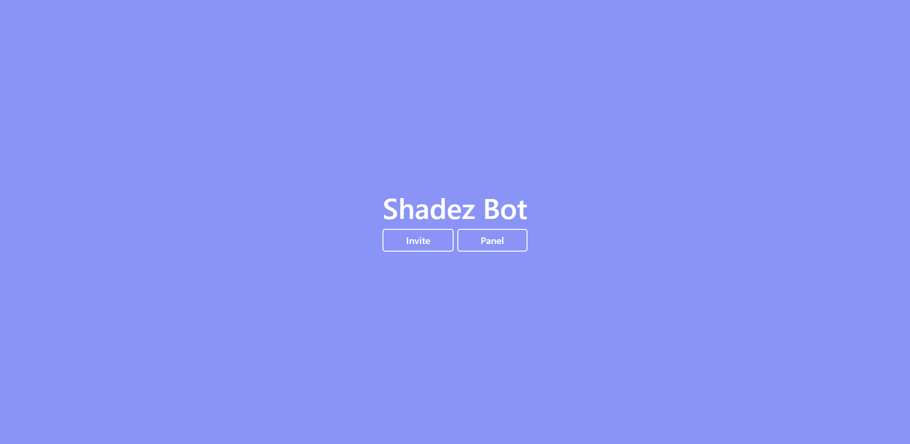
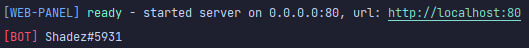

# 🕶️ Shadez 🕶️
A template discord bot setup for a Web Panel + Discord.JS bot Combination

## Installation
> Not available during beta.

## Commands
| Command  | Use Case |
| ------------- | ------------- |
| `yarn paneldev`  | Start panel in development mode.  |
| `yarn panelbuild`  | Build panel in production mode.  |
| `yarn panelstart`  | Start panel in production mode.  |
| `yarn botdev`  | Start bot in development mode.  |
| `yarn botbuild`  | Build bot in production mode.  |
| `yarn botstart`  | Start bot in production mode.  |
| `yarn build`  | Build everything in production mode.  |
| `yarn start`  | Start everything in production mode.  |

## Contributing
Want to help out with making a public template for discord bots with panels?
Feel free to make a fork, and PR to your heart's content.

## Support & Issues
Having trouble using Shadez? Feel free to open a [discussion](https://github.com/Fredthedoggy/Shadez/discussions/) in the [discussions tab](https://github.com/Fredthedoggy/Shadez/discussions/).

Found an issue or bug? Open an [issue](https://github.com/Fredthedoggy/Shadez/issues).

## Current State
### Main Page

### Panel Page
Coming soon™
### Execution Terminal

